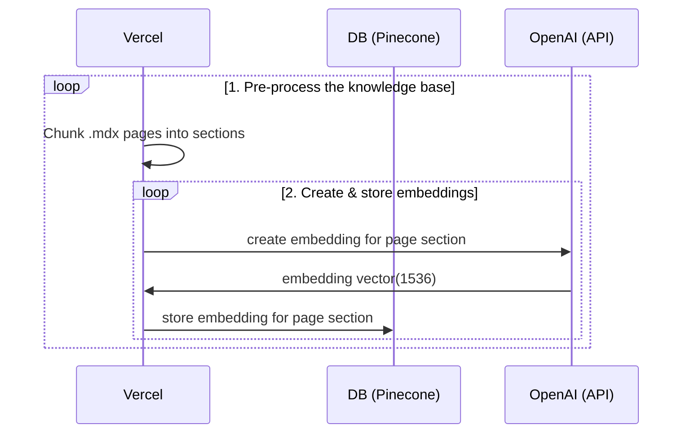
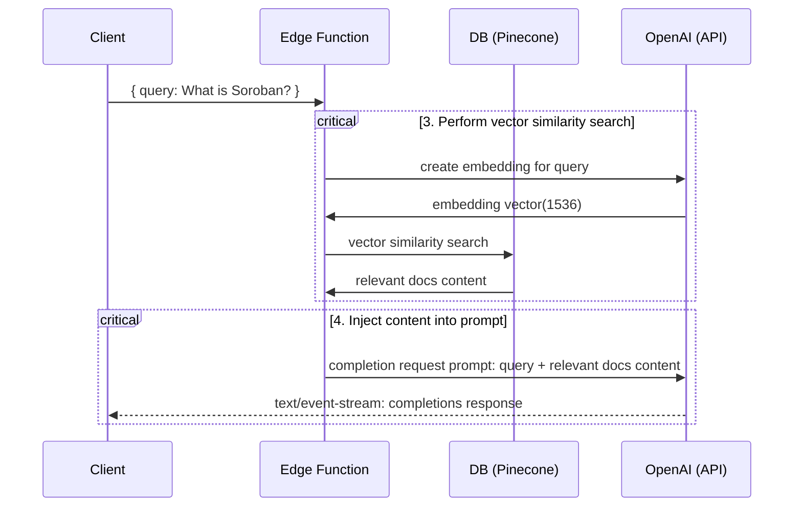

# StellarGPT Documentation Search with Pinecone

StellarGPT is a powerful tool that leverages the capabilities of OpenAI's GPT-3.5 Turbo model to provide users with contextually relevant answers from the Stellar documentation. By processing `.mdx` files within the `pages` directory, it serves as a bridge between user queries and the vast knowledge base of Stellar.


## Technical Overview

Creating a custom StellarGPT involves:

1. **👷 Build time**: Pre-process the knowledge base (`.mdx` files in the `pages` folder).
2. **👷 Build time**: Generate embeddings using Pinecone and store them.
3. **🏃 Runtime**: Execute vector similarity search to identify content relevant to the user's query.
4. **🏃 Runtime**: Inject the identified content into the OpenAI GPT-3.5 Turbo model prompt and relay the response to the user.

## 👷 Build Time

Steps 1 and 2 occur during the build phase. The [`generate-embeddings`](./lib/generate-embeddings.ts) script is executed, which:

- Chunks `.mdx` pages into sections.
- Creates embeddings for each section using OpenAI's API.
- Stores the embeddings using Pinecone.





## 🏃 Runtime

Steps 3 and 4 are executed during runtime, i.e., when a user submits a query. The process involves:

- Creating an embedding for the user's query.
- Performing a vector similarity search to retrieve relevant documentation content.
- Injecting this content into the OpenAI GPT-3.5 Turbo model's prompt.
- Streaming the model's response back to the user.

Relevant files include the [`SearchDialog` (Client)](./components/SearchDialog.tsx) component and the [`vector-search` (Edge Function)](./pages/api/vector-search.ts).




## Local Development

### Configuration

- Copy the example environment file: `cp .env.example .env`.
- Set your `OPENAI_KEY`,`PINECONE_API_KEY`, `PINECONE_ENVIRONMENT`, `PINECONE_INDEX`  in the `.env` file.


### Start the Next.js App

```bash
pnpm dev
```

### Custom `.mdx` Docs

1. Ensure your documentation is in `.mdx` format.
2. Regenerate embeddings: `pnpm run embeddings`.
3. Refresh the NextJS localhost:3000 rendered page.

## Further Reading

- Explore [Pinecone's vector embeddings](https://www.pinecone.io/learn/vector-embeddings/).
